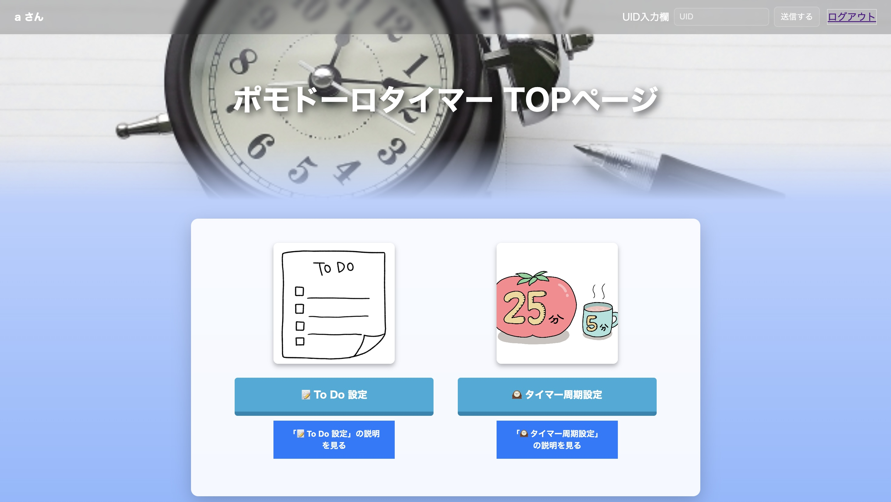

# TickStack

## プロジェクト概要

TickStackは、 M5stuckと呼ばれる小さな機器を使ったスマートフォンを手元に置かずに学習に必要な機能だけを利用できる学習支援システムです。

M5StackとWebアプリケーションを連携させ、ポモドーロタイマーやToDo管理機能を実装し、学習中のスマートフォン利用による集中力低下を防ぐことを目的として開発をしました。

## 開発背景

本プロジェクトは、授業での「世の中の困りごとをITで解決する」「興味のある技術を活用する」「身近な不便をITで解消する」というテーマのもと、発案から実装まで1年をかけ開発をしました。

学習者は、学習中にタイマーやタスク管理のためスマートフォンを利用することが多く、その際にSNSや動画アプリなどの誘惑によって集中力が低下するという課題があります。

そこで私たちは、学習に必要な機能のみを利用できる専用デバイスとしてM5Stackを活用し、スマートフォンに依存しない環境を作るためにTickStackを開発しました。

## チーム構成

- 開発人数：5名
- 役割：サブリーダー兼Web画面作成担当

## 私の担当

### サブリーダー
- リーダーと協力したプロジェクト進行管理
- メンバーの進捗状況の確認
- 週間報告書の作成
- 開発等スケジュールの調整

### Web画面作成（HTML / CSS）
- HTML/CSSを用いた画面実装
- 配色やレイアウトの検討
- ボタンアニメーションなどのユーザビリティ向上施策

## システムの主な機能

### ToDo管理機能
- タスク登録
- 期限設定
- 完了／未完了管理
- カテゴリ分類

### ポモドーロタイマー機能
- 作業時間・休憩時間の設定
- 設定履歴の保存
- 学習サイクルの管理

### M5Stack連携
- 現在時刻表示
- タイマー表示
- ToDo表示
- タスク完了操作

## 使用技術

### 私が担当した技術
- HTML
- CSS

### プロジェクト全体で使用した技術
- HTML
- CSS
- JavaScript
- Python（Flask）
- MySQL
- Docker
- M5Stack
- GitHub

## 工夫した点

### 1. 学習に集中できるUI設計
学習支援ツールとして、視認性の高い色やシンプルなレイアウトで直感的に操作できる画面を作成しました。

### 2. チーム開発における進捗管理
他メンバーより技術力、開発力が乏しいため、サブリーダーとして、メンバーの進捗確認や日程調整を行いました。週一回の情報共有を通じて、チーム全体が開発状況や問題点を把握できる環境づくりに取り組みました。

## 画面イメージ

### TOP画面

### ToDo管理画面

### ポモドーロタイマー設定画面

### M5Stack表示画面

## 学んだこと

本プロジェクトを通じて、操作しやすい画面を設計することの難しさと面白さを経験し、見やすさや使いやすさを意識したUI設計の重要さを学びました。
また、自分には不足している知識や経験が多くあったため、分からないことは積極的にメンバーへ質問しながら理解を深めました。その経験を通じて、チーム開発において円滑なコミュニケーションが重要であることを強く実感しました。